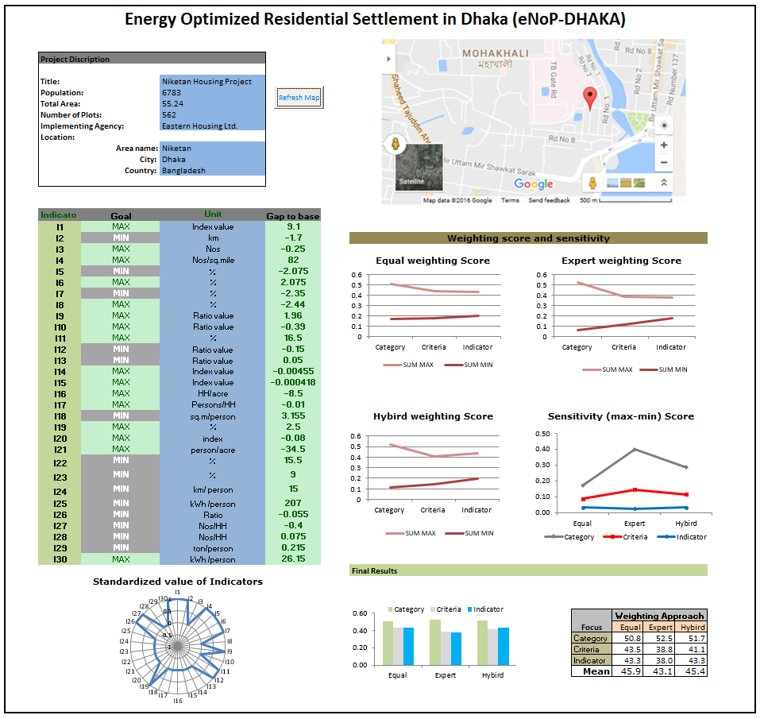

# eNoP-DHAKA

## INTRODUCTION
This an simple EXCEL based tool for assesment of energy optimization aspect in urban residential development projects.

This was developed as a part of research project - ["Energy Optimized Urban Structure and Urban Development (2013-2016)"](https://www.psb.uni-bonn.de/forschung/abgeschlossene-projekte/energie-minimierte-stadtstruktur-und-stadtplanung)

## METHOD
- Multi-critera Assesment (MCA)
- Analytic Hierarchy Process (AHP)

## Result page

For detail on this tool, method and results can be found in:

Sikder, Sujit Kumar (2017): **Exploring urban structure to approach energy optimization : The case of residential settlement development in Dhaka city, Bangladesh.** In: Publication Series of Institute of Geodey and Geoinformation, Bonn( Schriftenreihe), 57. Bonn, Germany.
Online access: http://hdl.handle.net/20.500.11811/1674

For futher questions: s.sikder@ioer.de
